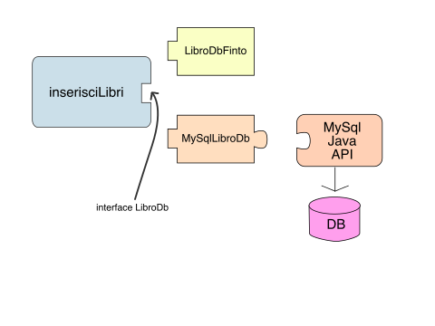

OOP Design
==========

Interfacce
----------
Ogni oggetto nella programmazione ad oggetti viene utilizzato da altri oggetti "client". I client possono utilizzare solamente l'interfaccia pubblica di un oggetto (ovvero tutti i metodi e variabili `public`).
I linguaggi ad oggetti, ci permettono di dichiarare anche solamente l'interfaccia pubblica di un oggetto, senza la sua implementazione, es.

```java
public interface FilmDb {

	public void inserisci(Film film);

	public Film[] cercaTutti();

	public Film[] cercaPerArgomento(String argomento);

}
```

A differenza degli oggetti, le interfacce non possono essere istanziate, questo perchè non sono una definizione completa di oggetto (manca l'implementazione dei metodi).
Un oggetto però può "implementare" un'interfaccia, e questo lo obbligherà a definire quei metodi dichiarati nell'interfaccia.

```java
public class FilmDbFinto implements FilmDb {

	public void inserisci(Film film) {
		System.out.println("Inserisci film " + film)
	}

	public Film[] cercaTutti() {
		/*
		 * Crea un array di 3 posizioni già inizializzato
		 */
		return new Film[] {
			new Film("Le Iene"),
			new Film("Man On The Moon"),
			new Film("The Imitation Game")
		};
	}

	public Film[] cercaPerArgomento(String argomento) {
		System.out.println("ricerca per: " + argomento);
		return cercaTutti();
	}
}
```

`implements` come `extends` crea una relazione *is-a* tra le due classi, facendo così diventare la classe `FilmDbFinto` un `FilmDb`, permettendo quindi dichiarazioni tipo:

```java
public static void main(String[] args) {
	FilmDb libroDb = new FilmDbFinto();

	inserisciLibri(3, libroDb);
}

public static void inserisciFilm(String titolo, FilmDb libroDb) {
	Film libro = new Film(titolo);
	System.out.println("Inserisci libro " + libro);

	libroDb.inserisci(libro);
}
```

Le interfacce sono un componente molto importante a livello di design, e un loro utilizzo corretto semplifica di molto il codice, perchè ci permettono di dividere il **cosa** un oggetto deve fare dal **come** esso lo esegue.
Nell'esempio precedente possiamo vedere come le operazioni su database per gestire un `Film` siano state dichiarate in un'interfaccia, che ci permette di utilizzarle tramite l'interfaccia, ma senza dover conoscere a priori il vero oggetto che verrà utilizzato per effettuare l'operazione.
Questo trucco ci permette di avere implementazioni differenti degli stessi metodi, e decidere quale implementazione utilizzare in base a quello che dobbiamo fare.
Definire le operazioni verso il database tramite un'interfaccia, ci permette di poter scrivere il metodo `inserisciLibri` senza dover conoscere (e/o implementare) la logica di connessione al database, anzi ci permette di avere anche *implementazioni* differenti degli stessi metodi. Es:
```java
public class MysqlFilmDb implements FilmDb {
	public void inserisci(Film film) {
		Mysql mysql = new Mysql("host", "username", "password");
		//implementazione di connessione e query mysql
	}
}

public class OracleFilmDb implements FilmDb {
	public void inserisci(Film film) {
		OracleDb oracle = new OracleDb("SID", "host", "username", "password");
		//implementazione di connessione e query mysql
	}
}
```
Interfacce come puzzle
-----
Riprendendo il metodo `inserisciLibri`, osserviamo bene come l'utilizzo dell'interfaccia ci permette di dividere due tipologie differenti di problemi e poterli risolvere in *contesti* differenti, senza che questi si conoscano l'un l'altro.
Il ruolo dell'interfaccia nel design OOP è proprio questo, ci permette di definire solamente l'interazione tra due componenti del sistema, lasciando che esse conoscano solamente il contratto (l'interfaccia), ed essendo libere così di evolversi in autonomia senza avere dipendenze.
Questo ci permette così di ragionare più facilmente su alcuni metodi, sapendo che determinate cose verranno gestite da chi implementa l'interfaccia, o quando si implementa l'interfaccia sapendo che determinate cose vengono gestite da chi la richiama.

La similitudine migliore per un sistema ad oggetti è un puzzle, dove l'interfaccia corrisponde all'attacco (al lato) di un pezzettino di un puzzle, definendo così l'attacco che deve avere un altro pezzo per poter essere unito:



Questa tecnica ci permette di poter avere implementazioni differenti degli stessi metodi, e poter utilizzare una determinata logica in un momento, ed un'altra in un altro caso. Si pensi ad esempio nella situazione di test di logiche complesse, supponendo che la nostra applicazione debba eseguire dei calcoli complessi facendo 3-4 ricerche nel database per poter calcolare qualcosa, potremmo avere un metodo che utilizza l'interfaccia `EntityDb` che implementa questa logica, demandando all'interfaccia l'esecuzione effettiva delle query.
In questa maniera potremmo utilizzare un'implementazione finta di `EntityDb` che restituisce dati preimpostati (*mock*) per eseguire dei test da codice dei quali siamo certi del risultato che il nostro metodo ci deve restituire, es:

```java
public class TestCalcoloComplesso {
	public static void main(String[] args) {
		EntityDb entityDb = new EntityDbMock();
		Integer risultatoAtteso = 25;
		Integer risultato = Applicazione.calcoloComplesso(entityDb);

		if (!Objects.equals(risultato, risultatoAtteso)) {
			System.out.println("Errore! Atteso: " + risultatoAtteso + ", invece è stato calcolato: " + risultato);
		}
		else {
			System.out.println("Test eseguito con successo!");
		}
	}
}
```

Classi Astratte
-----
In Java possiamo creare anche quelle che vengono chiamate classi astratte, che sono un mix tra classi normali (concrete) e interfacce. Una classe astratta definisce un tipo che non può essere istanziato, ma che può dichiarare metodi *astratti* che, come un'interfaccia, dovrà essere implementato dalla classe concreta che la estenderà.

```java
public abstract class AbstractRichiestaHttpManager {
	public String gestisci(HttpRequest request) {
		if (Objects.equals("GET", request.getMethod())) {
			return doGet(request);
		}
		else {
			return doPost(request);
		}
	}

	protected abstract String doGet(HttpRequest request);
	protected abstract String doPost(HttpRequest request);
}

public class PaginaFormPersona extends AbstractRichiestaHttpManager {
	@Override
	protected String doGet(HttpRequest request) {
		return "<html><body><form><input name='nome'/><input name='cognome'/></form></body></html>";
	}
	@Override
	protected String doPost(HttpRequest request) {
		String nome = request.getParameter("nome");
		String cognome = request.getParameter("cognome");

		Rubrica.inserisciPersona(nome, cognome, new MySqlPersonaDb());

		return "<html><body><h1>" + nome + " " + cognome + " inserito con successo!</h1></body></html>";

	}
}
```

```java
HttpRequest request = //riceve la request http
AbstractRichiestaHttpManager abstractRichiestaHttpManager = getHttpManagerPerUrl(request.getUrl());
abstractRichiestaHttpManager.gestisci(request);
```

Composition vs Inheritance
--------------------------

Molto spesso l'utilizzo di una classe astratta può essere riscritto attraverso l'utilizzo di un'interfaccia, si prenda l'esempio:

```java
public abstract class AbstractScriptMySql {
	public void esegui(MysqlDb db) {
		Connessione connessione = Mysql.creaConnessione(db);
		try {
			this.execute(connessione);
			connessione.commit();
		}
		catch (Exception e) {
			connessione.rollback();
		}
		finally {
			connessione.chiudi();
		}
	}

	protected void execute(Connessione connessione);
}

public class InserimentoIniziale extends AbstractScriptMySql {
	@Override
	protected void execute(Connessione connessione) {
		connessione.eseguiQuery("INSERT INTO colori VALUES ('GIALLO')");
		connessione.eseguiQuery("INSERT INTO colori VALUES ('ROSSO')");
		connessione.eseguiQuery("INSERT INTO colori VALUES ('VERDE')");
	}
}

//infine

InserimentoIniziale inserimento = new InserimentoIniziale();
inserimento.esegui(DbApplicazione.crea());
```

In questo caso può essere riscritto come:

```java
public interface ScriptLogic {
	void execute(Connessione connessione);
}

//ex AbstractScriptMySql
public class MysqlScript {
	private ScriptLogic logic;

	public MysqlScript(ScriptLogic logic) {
		if (logic == null) {
			throw new RuntimeException("La logica non può essere null");
		}
		this.logic = logic;
	}

	public void esegui(MysqlDb db) {
		Connessione connessione = Mysql.creaConnessione(db);
		try {
			this.logic.execute(connessione);
			connessione.commit();
		}
		catch (Exception e) {
			connessione.rollback();
		}
		finally {
			connessione.chiudi();
		}
	}
}

public class InserimentoIniziale implements ScriptLogic {
	@Override
	protected void execute(Connessione connessione) {
		connessione.eseguiQuery("INSERT INTO colori VALUES ('GIALLO')");
		connessione.eseguiQuery("INSERT INTO colori VALUES ('ROSSO')");
		connessione.eseguiQuery("INSERT INTO colori VALUES ('VERDE')");
	}
}

//infine

MysqlScript script = new MysqlScript(new InserimentoIniziale());
script.esegui(DbApplicazione.crea());
```

Anonymous Class
---------------
Java in realtà ci permette di istanziare classi astratte e interfacce, a patto però che gli venga fornita un'implementazione dei metodi, ad esempio avendo:

```java
public interface TaskGenerico {
	/*
	 * Come 'abstract' anche il 'public' nelle interfacce è implicito
	 */
	void esegui();
}
```

Possiamo poi usarla come:

```java
TaskGenerico task = new TaskGenerico() {
	public void esegui() {
		System.out.println("Fai qualcosa!");
	}
};
eseguiTraDieciMinuti(task);
```

oppure:

```java
eseguiTraDieciMinuti(new TaskGenerico() {
	public void esegui() {
		System.out.println("Fai qualcosa!");
	}
});
```

Generics
-----
Ci sono casi in cui un oggetto lavori con un altro oggetto senza che gli interessi il suo tipo, un esempio è la lista.

```java
public class List {
	private Object[] values;

	public List() {
		values = new Object[0];
	}

	public void add(Object o) {
		Object[] newValues = Arrays.copyOf(values, values.length + 1);
		newValues[newValues.length - 1] = o;
		this.values = newValues;
	}

	public Object get(Integer i) {
		return this.values[i];
	}

	public int size() {
		return this.values.length;
	}

	public String toString() {
		return Arrays.toString(this.values);
	}
}
```

L'utilizzo di queste classi però porta a del codice "sporco" e ripetuto, per gestire i cast degli oggetti:

```java
public static void main(String[] args) {
	List lista = new List();
	lista.add("pippo");
	lista.add("topolino");
	lista.add("paperino");

	Object valore = lista.get(1);

	System.out.println("Il valore in posizione 1 è: " + valore);

	/*
	 * Per poter utilizzare il contenuto della lista, per la classe che in realtà è (String)
	 * abbiamo bisogno di eseguire il cast, perchè la lista dichiara al suo interno un array di Object
	 */
	String stringa = (String) lista.get(0);

	/*
	 * La classe lista dichiara il metodo add con Object, quindi qualsiasi tipo di oggetto può essere passato.
	 * Questo permette alla lista di contenere oggetti differenti, che risulta molto prone ad errori.
	 */
	lista.add(new Persona("Oliver", "Sacks"));
}
```

Il problema degli oggetti generici in Java è stato risolto con l'utilizzo dei *Generic*.
Ovvero una classe nella sua definizione potrà dichiarare che utilizza un tipo `T` generico, che potrà essere ridefinito al momento dell'utilizzo della classe.

```java
public class List<T> {
	private T[] values;

	public List() {
		this.values = new T[0];
	}
	public void add(T o) {
		/*
		 * Anche i metodi statici possono dichiarare dei tipi generici, altrimenti il metodo
		 * copyOf sarebbe costretto a restituire un array di Object.
		 */
		T[] newValues = Arrays.copyOf(values, values.length + 1);
		newValues[newValues.length - 1] = o;
		this.values = newValues;
	}

	public T get(Integer i) {
		return this.values[i];
	}

	public int size() {
		return this.values.length;
	}

	public String toString() {
		return Arrays.toString(this.values);
	}
}
```
E si utilizzano:

```java
public static void main(String[] args) {
	/*
	 * Dichiariamo al compilatore che il tipo 'T' di List in questo caso è 'String'
	 */
	List<String> lista = new List<>();
	lista.add("pippo");
	lista.add("topolino");
	lista.add("paperino");

	Object valore = lista.get(1); //Essendo una stringa anche un Object, questa riga continua ad essere valida

	System.out.println("Il valore in posizione 1 è: " + valore);

	/*
	 * Il metodo 'get' ora restituisce un tipo 'T' che in questo caso vale 'String'
	 */
	String stringa = lista.get(0);

	/*
	 * Il metodo add prende in ingresso una variabile i tipo 'T', il compilatore ci avvertirà che non gli stiamo passando
	 * una String
	 */
//	lista.add(new Persona("Oliver", "Sacks"));
}

public static <T> List<T> concat(List<T> a, List<T> b) {
	List<T> result = new List<>();
	for (int i = 0 ; i < a.size() ; i++) {
		result.add(a.get(i));
	}
	for (int i = 0 ; i < b.size() ; i++) {
		result.add(b.get(i));
	}
	return result;
}

List<String> lista1 = new List<>()
lista1.add("ciao");

List<String> lista2 = new List<>()
lista2.add("ciao");

List<Sting> unione = concat(lista1, lista2);


List<Integer> lista3 = new List<>()
lista3.add(1);

//List<Sting> unione = concat(lista1, lista3);
```

I generics possono definire un tipo base di partenza (oltre Object) (utilizzo avanzato)
